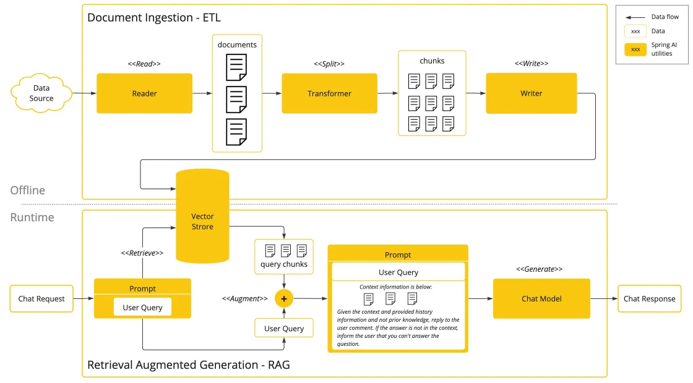

# AI 超级智能体项目（cheese-ai-agent）

> 作者：[程序员cheese](https://yuyuanweb.feishu.cn/wiki/Abldw5WkjidySxkKxU2cQdAtnah)
>
> 技术栈：Java 21 · Spring Boot 3 · Spring AI 1.0.0 · Ollama · Vue 3

---

## 目录

- [项目介绍](#项目介绍)
- [功能特性](#功能特性)
- [技术栈](#技术栈)
- [项目结构](#项目结构)
- [核心能力说明](#核心能力说明)
- [部署指导](#部署指导)
  - [环境要求](#1-环境要求)
  - [依赖准备](#2-依赖准备)
  - [配置说明](#3-配置说明)
  - [构建与启动](#4-构建与启动)
  - [接口验证](#5-接口验证)
  - [常见问题](#6-常见问题)
- [接口一览](#接口一览)

---

## 项目介绍

这是一套以 **AI 开发实战** 为核心的项目教程，通过开发 **AI 面试大师应用 + 拥有自主规划能力的超级智能体（CheeseManus）**，揭开新时代程序员必知必会的 AI 核心概念、AI 实用工具、AI 编程技术、AI 框架原理、AI 调优技巧，大幅增加求职的竞争力。


**AI 面试大师应用**：依赖 AI 大模型解决用户的面试问题，支持多轮对话、基于自定义知识库进行问答、自主调用工具和 MCP 服务完成任务（比如调用地图服务获取附近地点并制定面试计划）。


**自主规划智能体 CheeseManus**：基于 ReAct 模式自主规划，可利用网页搜索、资源下载和 PDF 生成工具，帮用户制定完整的面试计划并生成文档。


学会这个项目后，你不仅能开发 AI 面试大师，还能灵活开发各种复杂的 AI 应用。

## 功能特性

- **AI 面试大师应用**：多轮对话、对话记忆持久化、RAG 知识库检索、工具调用、MCP 服务调用。
- **AI 超级智能体**：根据用户需求自主推理和行动，直到完成目标。
- **AI 工具集**：联网搜索、文件操作、网页抓取、资源下载、终端操作、PDF 生成、终止对话。
- **AI MCP 服务**：从特定网站搜索图片（cheese-image-search-mcp-server）。
- **思考与正文隔离的流式对话**：基于 Ollama 原生 `/api/chat`（NDJSON）实现 `thinking` / `content` 增量独立推送（SSE），规避思考型模型内容被吞的问题。

## 技术栈

项目以 Spring AI 开发框架实战为核心，涉及多种主流 AI 客户端和工具库的运用。

- Java 21 + Spring Boot 3.4
- Spring AI 1.0.0（spring-ai-bom）+ LangChain4j
- RAG 知识库 + PGvector 向量数据库（可选）
- Tool Calling 工具调用 + MCP 模型上下文协议
- ReAct Agent 智能体构建
- SSE 异步推送
- Ollama 大模型本地部署（qwen3.5:9b 等）
- 前端：Vue 3 + Vite + axios
- 第三方接口：SearchAPI / Pexels API / 高德地图（AMap）
- 工具库：Hutool、Kryo 高性能序列化、Jsoup 网页抓取、iText PDF 生成、Knife4j 接口文档

RAG 核心特性实战：



项目架构设计图：


## 项目结构

```text
cheese-ai-agent/
├── pom.xml                                 # 主项目 Maven 配置（Spring Boot 3.4.4）
├── Dockerfile                              # Docker 构建文件（JDK21 + Maven 预装镜像）
├── src/main/
│   ├── java/com/cheese/cheeseaiagent/      # 后端源码
│   │   ├── controller/                     # AiController / HealthController 等
│   │   ├── service/                        # 含 OllamaNativeChatService（thinking/content 隔离）
│   │   └── ...
│   └── resources/
│       ├── application.yml                 # 主配置（端口 / Ollama / MCP 等）
│       └── application-prod.yml            # 生产环境覆盖配置（默认留空）
├── cheese-ai-agent-frontend/               # 前端（Vue 3 + Vite，端口 5173）
├── cheese-image-search-mcp-server/         # 图片搜索 MCP 服务（可独立打包）
└── mcp-servers.json                        # MCP 客户端服务注册配置
```

## 核心能力说明

### thinking / content 隔离的流式对话

思考型模型（如 qwen3.5:9b）在 Spring AI 1.0.0 的 `OllamaApi.Message` 中**不解析 `thinking` 字段**，会导致 `ChatClient` 的 `content` 恒为空，且思考 token 耗尽 `num_predict` 额度（`done_reason=length`）。

本项目通过 `OllamaNativeChatService` **绕过 Spring AI 流式管道**，直连 Ollama 原生 `/api/chat`（`stream=true`，NDJSON 逐行解析）：

- 单独读取 `message.thinking` 与 `message.content` 增量，分别推送为 SSE 事件 `event:thinking` / `event:content` / `event:done`。
- 通过 `options.num_predict` 显式设置生成预算上限，避免思考内容挤占正文。
- 原 `/api/ai/inter_view_app/chat/sse` 接口保持不动，新增 `/api/ai/inter_view_app/chat/sse_isolated` 提供隔离能力。

---

## 部署指导

### 1. 环境要求

| 组件 | 版本要求 | 说明 |
| --- | --- | --- |
| JDK | 21+ | 项目编译与运行所需（Docker 镜像使用 amazoncorretto-21） |
| Maven | 3.9+ | 构建工具 |
| Ollama | 最新稳定版 | 本地大模型服务，默认端口 `11434` |
| PostgreSQL + PGVector | 任意支持 PGVector 的版本 | **仅当启用 RAG / PgVector 存储时必需** |
| Node.js + npm | 18+ / 对应 npm | **仅当需要启动前端或通过 `npx` 启动 MCP server 时必需** |
| Docker（可选） | 最新稳定版 | 容器化构建与部署 |

### 2. 依赖准备

#### 2.1 拉取 Ollama 模型

本项目使用 Ollama 本地推理，请先确认所需模型已拉取：

```bash
# 对话 / 推理模型
ollama pull qwen3.5:9b

# 向量模型（启用 RAG 知识库时必需）
ollama pull nomic-embed-text
```

验证服务可用：

```bash
ollama list
curl http://localhost:11434/api/tags
```

#### 2.2 MCP 服务与 API Key

本项目注册了两个 MCP 服务（见根目录 `mcp-servers.json`）：

| 服务名 | 启动方式 | 所需 API Key |
| --- | --- | --- |
| `amap-maps` | `npx` 启动 | 高德地图开放平台 Key（`AMAP_MAPS_API_KEY`） |
| `cheese-image-search-mcp-server` | `java -jar` 启动本地 jar | 无（内置图片搜索） |

**API Key 配置**：请勿在代码或配置中提交真实 Key。将 `mcp-servers.json` 中的 `AMAP_MAPS_API_KEY` 环境变量占位替换为你自己的值，例如：

```bash
# Windows PowerShell
$env:AMAP_MAPS_API_KEY = "YOUR_AMAP_MAPS_API_KEY"

# Linux / macOS
export AMAP_MAPS_API_KEY="YOUR_AMAP_MAPS_API_KEY"
```

> 高德地图 Key 申请地址：https://console.amap.com/ （需要启用 Web 服务 API）。

#### 2.3 图片搜索 MCP 服务

`cheese-image-search-mcp-server` 为独立 Maven 子模块，需先构建其可执行 jar 供主应用以 `java -jar` 方式拉起：

```bash
cd cheese-image-search-mcp-server
mvn clean package -DskipTests
# 产物：target/cheese-image-search-mcp-server-0.0.1-SNAPSHOT.jar
```

> `mcp-servers.json` 中该服务以 `java -jar` 方式启动，并**必须关闭 Spring Boot banner**（配置了 `--spring.main.banner-mode=off` 等参数），否则 banner 输出会污染 MCP 的 stdio 协议通道导致握手失败。

### 3. 配置说明

核心配置位于 `src/main/resources/application.yml`，关键项如下：

| 配置项 | 默认值 | 说明 |
| --- | --- | --- |
| `server.port` | `8123` | 后端服务端口 |
| `server.servlet.context-path` | `/api` | 接口统一前缀 |
| `spring.ai.ollama.base-url` | `http://localhost:11434` | Ollama 服务地址 |
| `spring.ai.ollama.chat.options.model` | `qwen3.5:9b` | 对话模型名 |
| `spring.ai.ollama.chat.options.num-ctx` | `16384` | 上下文窗口大小 |
| `spring.ai.mcp.client.*.request-timeout` | `120s` | MCP 服务请求超时 |
| `spring.datasource.*` | `localhost:5432/cheese_ai_agent` | **仅 RAG / PgVector 场景需要**，默认注释 |
| `search-api.api-key` | — | SearchAPI 的 Key（从配置读取，勿提交真实值） |

按环境调整的注意事项：

- 生产环境可通过 `application-prod.yml` 覆盖上述配置（`--spring.profiles.active=prod`），该文件默认留空，注意**不要提交敏感信息**。
- 若不需要 RAG / PGVector，保持 `datasource` 与 pgvector 相关配置注释即可，无需安装 PostgreSQL。
- 变更端口后，同步调整前端 `vite.config.js` 中的代理目标。

### 4. 构建与启动

#### 4.1 后端（本地方式）

```bash
cd cheese-ai-agent

# 编译打包（跳过测试）
mvn clean package -DskipTests

# 启动（默认使用 application.yml）
java -jar target/cheese-ai-agent-0.0.1-SNAPSHOT.jar

# 或使用生产环境配置
java -jar target/cheese-ai-agent-0.0.1-SNAPSHOT.jar --spring.profiles.active=prod
```

> 首次启动前请确保：① Ollama 服务已启动且模型已拉取；② 图片搜索 MCP 服务的 jar 已构建；③ MCP 相关 API Key 环境变量已设置。

启动成功后访问健康检查：`http://localhost:8123/api/health`，返回 `ok` 即正常。

#### 4.2 前端（可选）

```bash
cd cheese-ai-agent-frontend
npm install
npm run dev
# 访问 http://localhost:5173 ，已配置 /api 代理到 http://localhost:8123
```

#### 4.3 Docker 方式

项目根目录已提供 `Dockerfile`（基于 `maven:3.9-amazoncorretto-21`，自动编译并运行）：

```bash
# 构建镜像
docker build -t cheese-ai-agent .

# 运行容器（将宿主机 Ollama 与宿主机网络打通，Ollama 默认 11434）
docker run -d --name cheese-ai-agent \
  -p 8123:8123 \
  --add-host=host.docker.internal:host-gateway \
  cheese-ai-agent
```

> 容器内访问宿主机 Ollama 时，将 `application.yml` 中 Ollama `base-url` 改为 `http://host.docker.internal:11434`。

### 5. 接口验证

后端启动后可分别验证以下接口（均以 `context-path=/api` 为前缀）：

**健康检查**

```bash
curl http://localhost:8123/api/health
# 预期：ok
```

**同步对话（AI 面试大师）**

```bash
curl "http://localhost:8123/api/ai/inter_view_app/chat/sync?message=你好&chatId=demo"
# 预期：返回完整文本回复（同步等待）
```

**SSE 流式对话（原接口）**

```bash
curl -N "http://localhost:8123/api/ai/inter_view_app/chat/sse?message=你好&chatId=demo"
# 预期：SSE 事件流，逐段推送 content
```

**SSE 流式对话（thinking / content 隔离）**

```bash
curl -N "http://localhost:8123/api/ai/inter_view_app/chat/sse_isolated?message=你好&chatId=demo&numPredict=1024"
# 预期：依次收到 event:thinking / event:content / event:done
```

> `numPredict` 为生成预算上限（对应 `num_predict`）。若值过小（如 200），思考可能占满额度导致 `content` 为空、`done_reason=length`；建议 1024 及以上以正常产出正文。

**CheeseManus 智能体**

```bash
curl -N "http://localhost:8123/api/ai/manus/chat?message=帮我制定一份面试计划"
# 预期：SSE 流式返回，智能体自主调用工具直至完成目标
```

### 6. 常见问题

**Q1：SSE 流式接口 `content` 恒为空，只有思考内容？**

思考型模型（qwen3.5:9b 等）的 `thinking` 字段在 Spring AI 1.0.0 原生适配中不被解析，思考 token 会耗尽 `num_predict` 额度。请使用 `/api/ai/inter_view_app/chat/sse_isolated` 接口，并调大 `numPredict`（建议 ≥1024）。

**Q2：MCP 服务握手失败 / 连接异常？**

`cheese-image-search-mcp-server` 以 stdio 方式启动时必须关闭 Spring Boot banner；同时确认 jar 已构建、`mcp-servers.json` 中命令路径与实际 jar 名一致、请求超时（`request-timeout`）足够（当前 120s）。

**Q3：启动报数据源相关错误？**

未启用 RAG / PgVector 时，请保持 `application.yml` 中 `datasource` 与 pgvector 相关配置注释状态；如确实需要，请先安装并初始化 PostgreSQL 并创建 `cheese_ai_agent` 数据库。

**Q4：Docker 部署后无法访问宿主机 Ollama？**

容器内通过 `host.docker.internal` 访问宿主机（需 `--add-host=host.docker.internal:host-gateway`），并将 Ollama `base-url` 指向该地址。若使用 Docker Desktop 之外的引擎，请按平台调整 host 映射方式。

---

## 接口一览

| 方法 | 路径（含 /api 前缀） | 说明 |
| --- | --- | --- |
| GET | `/health` | 健康检查，返回 `ok` |
| GET | `/ai/inter_view_app/chat/sync` | 面试大师同步对话 |
| GET | `/ai/inter_view_app/chat/sse` | 面试大师 SSE 流式对话（原接口） |
| GET | `/ai/inter_view_app/chat/server_sent_event` | 面试大师 SSE（事件实现） |
| GET | `/ai/inter_view_app/chat/sse_emitter` | 面试大师 SSE（SseEmitter 实现） |
| GET | `/ai/inter_view_app/chat/sse_isolated` | 面试大师 SSE（thinking/content 隔离） |
| GET | `/ai/manus/chat` | CheeseManus 智能体对话（SSE） |

> 接口文档可借助 Knife4j 查看（启动后访问 Spring Boot 内置文档路径）。
