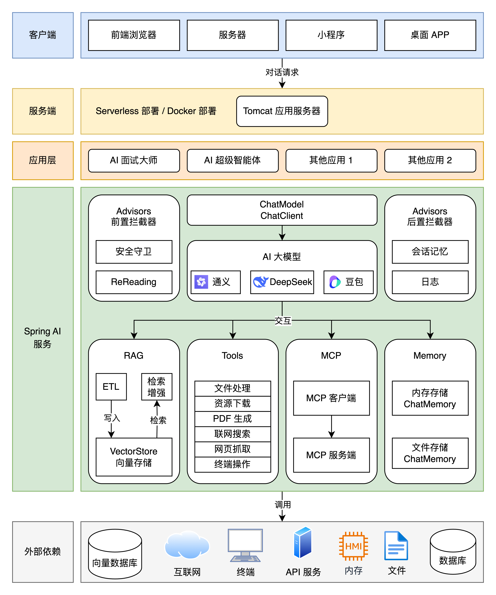
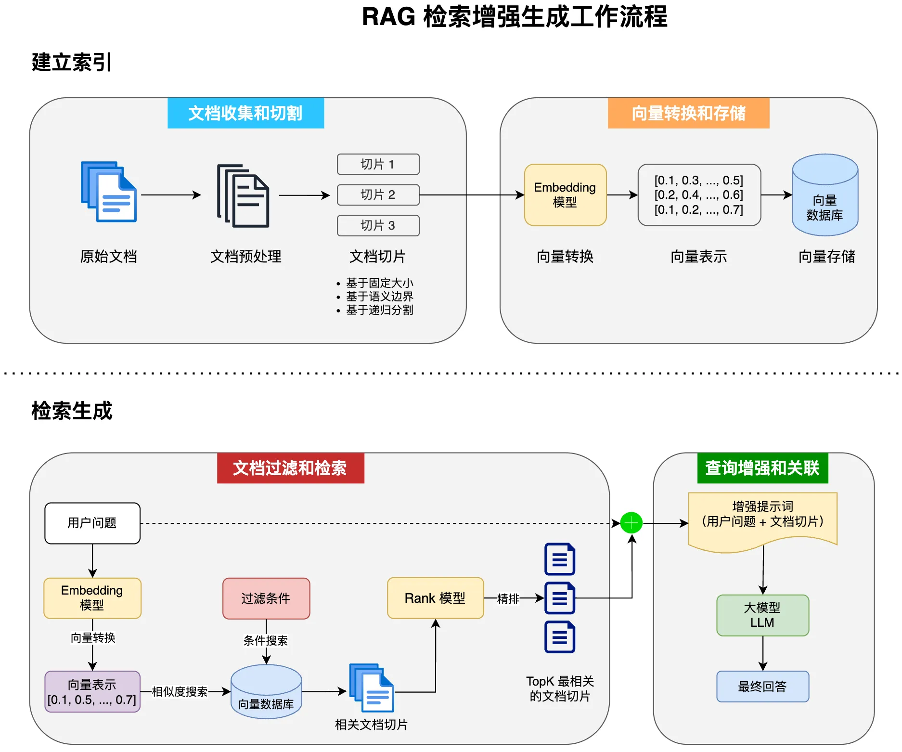
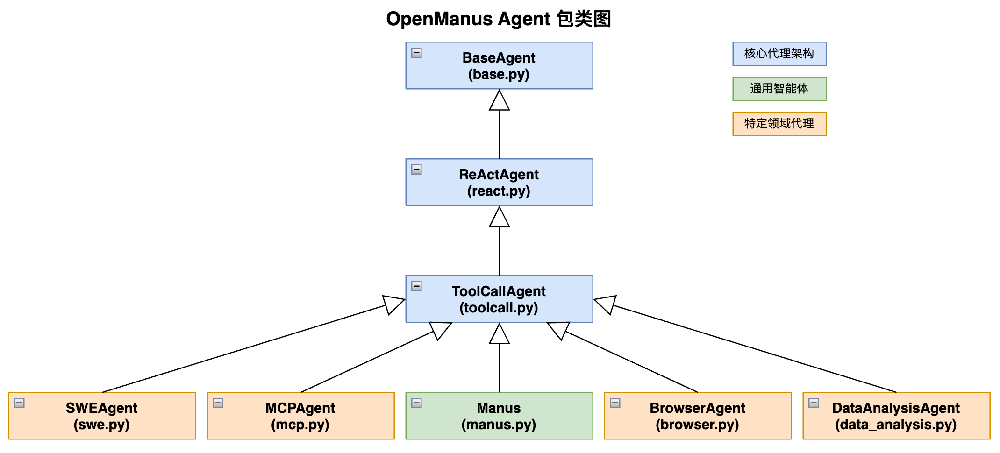
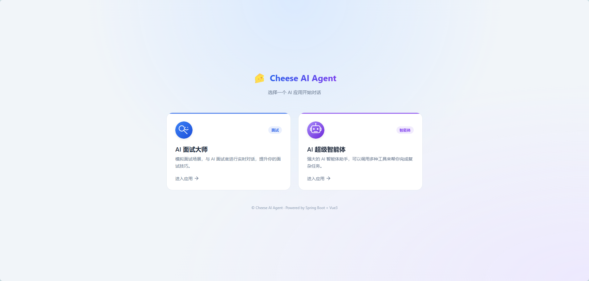

# 我开源了一个 Spring AI Agent 项目

我最近做了一件事。

把一个用 Spring AI 写的 Agent 项目整理好，开源了。

名字叫 **cheese-ai-agent**。如果你是个 Java 工程师，又正好对 AI 应用开发有点想法，这个项目大概能帮你省不少事。

先说点实在的。这几年 AI 热，圈子里聊得最多的是 Python，是 LangChain，是那一堆快速迭代的框架。Java 这边呢，一直有点安静。不少做 Java 的朋友私下问我，是不是 Java 已经被这波 AI 落下了。

我的答案一直没变过。

**Java 没掉队，Spring AI 这条路是通的。**

这个项目就是我把这条路一步步走通的记录。里面有 AI 面试大师，有一个能自己拆任务、自己调工具干活的超级智能体 CheeseManus。从 Prompt 到记忆，从 RAG 到工具调用，从 MCP 客户端到自研 MCP 服务，我都把代码一行行写了出来，并且留了详细注释。

这篇文章，我想以一名 Java 架构师、一名 AI 应用开发工程师的身份，把整个项目的设计思路和技术选型讲给你听。不是教程式的罗列，是我真实踩过的坑、真正想明白的东西。

往下看。

## 01 这个项目到底长什么样

先把全景摆出来，不然聊细节你会晕。

cheese-ai-agent 是一套前后端分离的 AI 应用。后端是 Java 21 加 Spring Boot 3.4 加 Spring AI 1.0.0，前端是 Vue 3 加 Vite。模型这条线比较灵活，本地可以跑 Ollama，云端可以切到阿里百炼的 DashScopeChatModel。向量数据库用 PGVector，也就是 PostgreSQL 加一个 pgvector 扩展。

它不只是一个 demo。它里面有两个相对完整的应用。

第一个是 **AI 面试大师**。你把它当作一个模拟面试官，它先摸清你的背景，再一步步追问你的技术细节，最后给你出一份反馈和学习清单。它支持多轮对话、记忆持久化、基于自定义知识库的 RAG 问答，还能自主调用工具和 MCP 服务。

面试大师的流程是一整条精心设计的主线。它不会一上来就抛难题，而是先通过破冰了解你的工作年限、技术栈和目标岗位。摸清底细之后，再顺着项目经历深挖下去，你简历上写的每一个关键词，都可能是它下一轮追问的入口。深度聊完，它会把话题铺开考察广度，再给你出一道需要当场拆解的开放设计题。最后把整场表现汇总成一份结构化的面试报告。

第二个是 **CheeseManus**。这是一个拥有自主规划能力的超级智能体，借鉴了 OpenManus 的架构。你给它一句「帮我制定一份面试计划」，它自己会拆解任务，调用联网搜索、资源下载、PDF 生成这些工具，最后交给你一份成型的文档。

一张架构图看明白它的分层。



这张图里有几个关键点，后面都会展开。中间那一层是 Spring AI 的核心，ChatModel 和 ChatClient 是入口，前后各挂了一串 Advisor 拦截器。往下是四大能力模块，RAG、Tools、MCP、Memory。这四个，基本就是现在一个 AI 应用的全部家当。

换句话说，把这个项目的每一个模块吃透，你就有能力搭出一个自己的 AI 应用骨架。这是它最大的价值，比那两个成品应用本身还重要。

## 02 为什么是 Spring AI

这是被问得最多的问题。Java 生态里有 LangChain4j，也有更底层直接调 HTTP 接口的路子，为什么我最终落在 Spring AI 上。

做 Java 的人，绝大多数活在 Spring 生态里。你的团队会用 Spring Boot，你的项目会用依赖注入，你对 Bean 的生命周期、对那套约定优于配置的哲学，已经熟得不能再熟。Spring AI 就是把 AI 的能力，拉进了这套你本来就会的东西里。

一个 ChatModel，通过构造函数注入，剩下的交给 Spring。一个 VectorStore，一个 ToolCallback，全部是 Bean。你不用重新学一套心智模型，这是最省力的一点。

第二个理由，是它的抽象层做得好。模型这边，Ollama、DashScope、OpenAI、DeepSeek，统统收敛成 ChatModel 和 EmbeddingModel 两个接口。换模型不改业务代码，这在实际项目里是硬需求。向量库这边，SimpleVectorStore、PgVectorStore、Redis、Chroma，收敛成 VectorStore 一个接口。工具的接入也一样。

第三个理由，Spring AI 1.0.0 已经稳定了。1.0 之前我是不太敢在生产上用的，接口变来变去。到了 1.0，ChatClient 这套编程模型定型，Advisor 链、RAG 模块、Tool Calling、MCP 支持，该有的都有，而且设计得挺干净。

说白了，Java 这边做 AI 应用，其实就是三选一。最原始的是自己拼 HTTP 请求调模型接口，灵活，但流式、重试、上下文这些全得自己管。中间一档是 LangChain4j，抽象全、社区活跃。还有一条，就是我选的 Spring AI，跟 Spring 全家桶无缝衔接。

要我说，如果你已经活在 Spring 生态里，Spring AI 是替你省心最多的那条路。它没有那么重的历史包袱，一套 ChatClient 的流式 API，简单直接。LangChain4j 也很好，我不是要拉踩，纯粹是从工程落地和团队上手成本出发做的选择。

还有一个我很看重的设计，Advisor 链。它有点像 Spring 的拦截器，但作用在对话上。你可以在一次大模型调用前后挂一串 Advisor，记忆、日志、RAG 检索、安全过滤，全都做成可插拔的插件挂在链上。这个设计把「对话增强」从业务代码里拆了出来，要什么能力，就挂什么 Advisor。后面你会看到，记忆和 RAG 都是这么挂上去的。

选了框架，接下来就是把这个框架琢磨透。我是一层一层往上搭的，先从最基础的对话开始。

## 03 从一段 Prompt 开始

AI 应用的地基不是模型，是提示词。模型再强，提示词写不好，出来的东西一样没法用。

在 Spring AI 里发起一次对话，核心就一个东西，ChatClient。它的编程模型是流式的，一行一行往下拼。

```java
String content = chatClient.prompt()
    .user(message)
    .advisors(spec -> spec.param(ChatMemory.CONVERSATION_ID, chatId))
    .call()
    .chatResponse().getResult().getOutput().getText();
```

就这么几行，就是一次完整的大模型调用。但真正决定质量的，是藏在 ChatClient 背后的那段系统提示词。

我把「AI 面试大师」的提示词写成了一个人设，一个拥有 15 年经验的阿里 P9 级别的 Java 面试官。这不是随便写的，我给它定了明确的角色、任务、严格规则、还有一套按轮次推进的面试流程。

它必须一次只问一个问题。它必须根据你的回答动态追问。它不准直接否定你，要先肯定亮点，再指出可改进的地方。

这里面藏着一个经验。

**好的提示词不是描述，是约束。**

你告诉模型它是什么，不如告诉它什么不能做，什么顺序做，什么格式输出。我把整个面试过程拆成了五个阶段，一共十八轮，从破冰收集背景，到深挖项目，再到广度考察和技术设计题，最后综合反馈。模型有了这条主线，就不会漫无目的地东问一句西问一句。

具体拆开看，这五个阶段各有侧重。第一关是背景摸底，问你几年经验、主力语言、做过哪些项目。第二关是项目深挖，挑一个你最得意的项目，追着问架构、难点、踩过的坑。第三关是广度考察，从多线程到 JVM，从分布式到中间件，看你的知识面有多宽。第四关是技术设计，给你一个真实场景当场设计，比如「设计一个高并发下单系统」。第五关是综合反馈，点出你的亮点和短板，再给一份学习建议。十八轮下来，一个人几斤几两，基本就摸透了。

提示词优化，说的就是这个。它不是玄学，是一次次试出来的。你跑一遍，看它哪里跑偏，就往哪里补一条规则。

我还专门给这套提示词加了一条反幻觉规则。不确定的内容，模型必须明确说「建议以官方文档为准」，不许编造用户没提过的信息。大模型最擅长一本正经地胡说八道，在面试这种严肃场景里，编一个不存在的知识点，比老老实实说不清楚更坑人。与其相信它的自觉，不如用规则把它摁住。

我还把提示词当成代码来治理。面试大师的核心提示词不是一个写死在代码里的长字符串，而是可以独立维护、持续迭代的。每次发现模型哪里回答得不对，我就去改一句规则、调一处约束，再重新跑一遍回归。时间久了你就会发现，提示词的版本和代码的版本一样重要，它们一起决定着一个 AI 应用的质量上限。

再往下一步，是结构化输出。我让这个面试应用还能生成一份面试报告。这里我用的是 Spring AI 的 `.entity()` 能力，告诉它把结果映射成一个 Java Record。

```java
record InterViewReport(String title, List<String> suggestions) { }
```

调用时一句 `.entity(InterViewReport.class)`，Spring AI 会自动让模型按这个结构输出 JSON，再反序列化成对象。这个能力看着简单，背后全是坑。我在项目里专门踩过一个。

默认的那段面试提示词，要求模型输出「【类型】【内容】【期望】」这种纯文本结构。而 `.entity()` 要的是 JSON。两边一打架，本地模型就开始输出以「【」开头的非 JSON 文本，反序列化直接抛异常。

我的解法是给结构化输出单独造一个 ChatClient，换一套专门的提示词，明确告诉它只输出 JSON、不许输出标记、不许加 Markdown 围栏，再配合 Ollama 的 format=json 参数，从模型层强制输出合法 JSON。

这一段我写在了代码注释里，就是想让别人少走一遍弯路。

提示词这一层，就这么点东西。**角色加约束加格式，再配上一套对抗不一致的处理方式**，基本就能把对话控制在手里。但对话还有一个致命问题没解决，它记不住事。

## 04 记忆，让对话不再失忆

大模型本身是无状态的。你这次发一句话，下次再发一句，它根本不知道你们刚才聊过什么。要做多轮对话，记忆这层必须自己搭。

Spring AI 里对应的概念是 ChatMemory，一个接口，负责按会话 ID 存消息、取消息。项目里我做了两种实现。

第一种是内存实现，MessageWindowChatMemory。它带一个滑动窗口，最多保留 N 条消息，超出就往里挤。这个窗口为什么重要，后面讲上下文窗口的时候你会明白。

第二种是我自己写的 FileBasedChatMemory，一个基于文件持久化的实现。它把这个会话的所有消息序列化成一个 .kryo 文件存到磁盘，应用重启之后记忆还在。

注意一个细节。序列化我用的是 Kryo，不是 JDK 自带的序列化。Kryo 快，而且能绕过无参构造器，对 Spring AI 里那些消息类型兼容性更好。这是个很小的决定，但正是这种小决定，把一个「能用」的项目和一个「好维护」的项目区分开。

记忆挂载也很有意思。Spring AI 用 Advisor 机制来做这件事，一个 MessageChatMemoryAdvisor，每次请求前自动把历史消息塞进上下文，请求后自动把新消息写回记忆。你只需要在请求里带上一个 conversationId。

这个 conversationId 就是会话隔离的关键。不同用户、不同对话，各存各的记忆，互不干扰。同一个用户换个会话，记忆从头开始。到了多租户场景，这个设计是必须的，不然用户 A 的记忆串到用户 B 那，就是事故了。

记忆这块还有一层更深的取舍，到底把什么放进上下文。最省事的是历史原样全塞，但会撞上下文窗口；进阶的做法是摘要式记忆，把长对话压成一段摘要。这个项目我选的是滑动窗口加条数上限，简单、可控、够用。真到了超长会话的场景，摘要式记忆会是我的下一步。

到这里，记忆就通了。但你很快会撞上那堵墙。

**记忆会膨胀，上下文窗口会被顶满。**

本地模型的上下文窗口默认是 4096。你的系统提示词本来就不短，再叠上多轮历史，很快就满了。满了之后模型直接空响应，一个字都不吐。我在配置里特意把 num-ctx 提到了 16384，注释里写清楚了原因。这不是拍脑袋，是被这个坑实实在在教育过。

所以记忆不是越多越好。滑动窗口、条数上限、还有后面要说到的思考内容不注入上下文，都是在跟这个有限的窗口较劲。控制好记忆的进出，你的应用才不会在聊到第十轮的时候突然哑掉。

## 05 RAG，从查得到到查得准

记忆解决的是「记住说过的话」，但它解决不了「知道没见过的东西」。你要让 AI 基于你自己的知识库回答问题，比如一份 Java 面试题库，就得靠 RAG。

RAG 说白了就三件事。先把文档切块、向量化、存进向量库，这是离线索引。用户提问时，把问题也向量化，去库里找出最相似的几块，这叫检索。最后把这些块连同问题一起塞给大模型，让它基于这些资料回答，这叫增强生成。

理解这个流程，看这张图最直观。



在这个项目里，我把 RAG 的每一步都做成了一个可替换的零件，并且给了多种实现。这正是架构师该有的思路，不把宝押在一种方案上。

文档加载，我用 Spring AI 的 MarkdownDocumentReader，从 classpath 里读 Markdown 知识文档，按分隔线切块，还能给每篇文档打上元信息标签。切块这里我还写了一个自定义的 Token 切分器备用。

向量存储，我给了三条路。默认是 SimpleVectorStore，一个内存向量库，开箱即用，适合开发调试。上生产就切到 PgVectorStore，维度 1536，用 HNSW 索引，余弦距离，全在 PostgreSQL 里，一套数据库搞定业务数据和向量数据。第三条是云端，接阿里百炼的 DashScopeDocumentRetriever，把知识库托管在云端。

项目里我准备了一份真实的 Java 面试知识库作为 RAG 的输入。把资料喂进向量库之后，面试大师就能基于这份资料回答，而不是靠模型自己瞎编。你换一份资料，比如公司内部的制度文档、产品手册，它就能变成另一个领域的问答助手。RAG 的价值，就在这份「可替换的知识底座」上。


说说底层。文本要先变成向量才能做相似度计算，这靠 Embedding 模型，本地我用 nomic-embed-text。一句话进去，出来一个高维浮点数数组，PGVector 里我配的维度是 1536。这个数字不是随便填的，得跟 Embedding 模型的输出对齐，否则写库直接报错。

切块也有讲究。切太大检索粒度粗，切太小语义不完整。固定大小切、按语义边界切、递归切，各有适用场景。这个项目里 Markdown 读取器默认按水平分隔线切块，另外留了一个 Token 切分器做备选。

向量搜索的具体实现，我配的是 HNSW 索引加余弦距离。HNSW 是一套近邻图算法，在召回率和速度之间平衡得很好，是目前向量库的主流选择。这些配置在代码里都是一行的事，但背后要理解的东西不少。

但光有检索还不够。检索不准，是整个 RAG 应用最痛的痛点。我在项目里专门做了两件「锦上添花」的事，都是为了把检索质量往上抬。

第一件是查询重写。用户问的问题往往是口语化的，「面试的时候被问高并发咋整」，这种话直接拿去向量检索，命中率很差。所以我加了一个 QueryRewriter，在检索前先用大模型把问题改写成更适合检索的形式，再拿去查。这是预处理阶段的一层转换，成本低，收益明显。

第二件是关键词增强。给每篇文档自动抽取关键词，写进元信息，检索时关键词能辅助命中。我用了 Spring AI 的 KeywordMetadataEnricher。

这里有个很真实的工程细节。关键词增强要调用大模型，本机 CPU 跑 qwen 系列模型，单次生成关键词要两分多钟，应用启动时对每个分块串行调用，启动时间长得不能接受。所以我把它暂时注释掉了，换轻量模型或者上 GPU 再开。这段我也写进了注释。

我特别想强调一句。

**能用和好用之间，差的全是这些看似琐碎的检索优化。**

再往下，我还做了一个自定义的 RAG Advisor，用 FilterExpressionBuilder 加状态过滤，再加相似度阈值和 TopK 控制。类似「只检索状态是单身的情感文档」这种需求，用内置的 QuestionAnswerAdvisor 就办不到，得自己拼一个 RetrievalAugmentationAdvisor。这就是把框架用透之后才有的自由。

## 06 Tool Calling，让模型动手

光会聊天的 AI 没多大用处。真正让 AI 从「聊天机器人」变成「能干活」的，是工具调用。

所谓 Tool Calling，就是你写一个普通方法，加个注解，把它暴露给模型。模型在自己该调用的时候，会告诉你调用哪个工具、传什么参数，你把结果拿回来再喂给它。

Spring AI 里，一个工具长这样。

```java
@Tool(description = "Search for information from Baidu")
public String searchWeb(
    @ToolParam(description = "Search query keyword") String query) {
    // 真实调用搜索接口，返回前 5 条结果
}
```

就一个 @Tool 注解，加上 @ToolParam 描述参数。模型会读注解里的 description 来决定什么时候用它。所以工具描述写得好不好，直接决定模型会不会调用它、调得对不对。

工具描述其实是一门隐形的提示词工程。模型不是看你的代码，而是看那段 description 来决定调不调你。描述太笼统，模型会在不该调的时候乱调；描述太苛刻，它又会不敢调。我给搜索工具写描述时，特意把「返回前 5 条结果」这种边界写进去，模型就知道一次最多能拿到什么。工具越多，描述越要精确，这是很多人在 Tool Calling 上翻的第一个跟头。

这个项目里，我给智能体准备了七件工具。文件操作、联网搜索、网页抓取、资源下载、终端操作、PDF 生成，还有一个终止对话的工具。

联网搜索接的是 SearchAPI，走百度引擎。网页抓取用的是 Jsoup。PDF 生成用的是 iText。文件操作能读写本地文件，终端操作能执行命令行，资源下载能从网络拉文件。这些工具单拎出来都不复杂，复杂的是工具调用链的编排。

七件工具里有个很特别的，叫「终止对话」。它是智能体停下来唯一的优雅出口。ReAct 循环不能让模型无限转下去，得给它一个明确的停止信号。我在工具集合里塞进一个 TerminateTool，模型觉得任务干完了就调它，循环收到信号就收尾。没有这个工具，智能体要么转到天荒地老，要么靠撞上最大步数才被迫停下。

Spring AI 有个 ToolCallingManager 来真正执行工具，还有一个叫 internalToolExecutionEnabled 的开关。这里有个特别隐蔽的坑。构造要调用工具的 Agent 时，我关了 Spring AI 内置的工具执行，改由自己手动维护调用流程和消息上下文。注释里明确写了，传工具时得用 `.toolCallbacks()` 而不是 `.tools()`，后者会去反射查找 @Tool 注解，找不到就报错。

这些坑，不写一遍代码，光看文档你是想不到的。开源项目里把这些都标出来，是我觉得最值的地方之一。

## 07 MCP 调用与 MCP Server 开发

工具调用很好用，但它有个局限。工具的代码得和你的应用在同一个进程里。你有没有想过，把工具拆出去，做成独立服务，让任何 AI 应用都能通过一个标准协议去调用它。

这就是 MCP，模型上下文协议。它想解决的就是 AI 世界里「工具」和「数据」的连接标准，你可以把它理解成 AI 界的 USB-C 接口。

这个项目里，MCP 的两端我都做了。

先说客户端。通过一个 mcp-servers.json 配置文件，我把两个外部的 MCP 服务注册了进来。一个是高德地图，通过 npx 启动，能查附近地点。另一个是我自己写的图片搜索服务，通过 java -jar 启动。

应用里通过 ToolCallbackProvider，把这些 MCP 工具和本地工具混在一起，模型根本分不清哪个是本地工具、哪个是远程 MCP 服务。对模型来说，都是「可以调用的工具」。这个体验很关键，它意味着你可以无限地往智能体上挂能力，而不用改主应用代码。

高德地图那个 MCP 服务是现成的第三方实现，我通过一行配置就把它挂进了智能体。你问「附近有什么咖啡店」，智能体会自动决定调用地图工具，而不是联网瞎搜。这种「即插即用的能力」，正是 MCP 最打动人的地方——它把能力的复用，从「复制代码」升级成了「引用服务」。

再说服务端。我写了一个独立的 MCP Server，专门做图片搜索。它本质上就是一个普通的 Spring Boot 应用，只不过把带 @Tool 注解的方法，通过 MethodToolCallbackProvider 暴露成 MCP 工具。

```java
@Bean
public ToolCallbackProvider imageSearchTools(ImageSearchTool tool) {
    return MethodToolCallbackProvider.builder()
        .toolObjects(tool)
        .build();
}
```

这个服务支持两种传输方式。stdio，走标准输入输出，适合本地进程拉起。sse，跑在 8127 端口上，适合远程调用。

这两种方式对应两种部署形态。本地开发，用 stdio 直接拉起 jar，最省事。要给别人调，或者部署成独立服务，就上 sse。MCP 这两年生态长得很猛，OpenAI 和 Anthropic 都站了台，未来这种标准化的工具接入，大概率会变成 AI 应用的标配能力。

MCP 开发里最让我印象深刻的坑，是一个特别不起眼的东西。Spring Boot 启动时默认会打印一个大大的 banner。可当你用 stdio 方式启动 MCP 服务时，这个 banner 会混进标准输出的协议通道里，直接把 MCP 的握手搞挂。解决办法就是启动参数里加一条把 banner 关掉。

你看，就是这么一个小事，能把你卡半天。类似的问题，我在整个开发过程中攒了不少，全都写进了 README 的常见问题里。

到这里，单点能力都齐了。但一个真正能自主干活的智能体，还需要把这些能力编排起来。接下来是重头戏。

## 08 CheeseManus，复刻一个 OpenManus

CheeseManus 是这个项目里我最想聊的部分。它是一个能自主规划、自主行动的超级智能体，架构借鉴了 OpenManus。

OpenManus 是一个开源的通用 Agent 框架，Python 写的，很多人因为它「几小时复刻 Manus」走红而认识它。它最核心的设计，是一套清晰的分层继承结构。



最底层是 BaseAgent，管状态和生命周期。往上是 ReActAgent，实现思考-行动的循环。再往上是 ToolCallAgent，给思考加上了工具调用的能力。最上面才是各种具体的智能体，比如 Manus、SWEAgent、MCPAgent。

我用 Java 把这个结构复刻了出来，对应关系一目了然。

BaseAgent 里我做了一个状态机。IDLE 空闲，RUNNING 运行中，FINISHED 完成，ERROR 出错。整个执行是一个步进循环，在最大步数上限内反复调用 step()，每一步都可以通过 SSE 实时推给前端。这里还内置了超时回调、完成回调、资源清理，这些都是做一个能上线的智能体逃不掉的细节。

ReAct 的精髓，我总结成一句话。

**让模型先想，再决定动不动手。**

每一轮，think() 阶段把历史消息、系统提示词、可用工具一起发给模型。模型返回两类结果，要么直接给文本回复，说明它觉得不用工具了，要么返回一串工具调用指令。有了指令，act() 阶段就真正去执行这些工具，把结果写回对话历史，供下一轮思考。

这个「思考-行动」的循环会一直转，直到模型调用那个终止工具，或者达到最大步数。CheeseManus 里我把最大步数从默认的 10 提到了 20，因为复杂的多步任务，10 步根本不够用。

贯穿整个循环的，是一个 messageList。它把每一轮的用户消息、助手消息、工具调用结果按顺序存起来，构成智能体的上下文。think() 拿它去问模型，act() 执行完工具再把结果追加回列表。这套消息管理看着朴素，却是智能体能连贯推理的关键，上下文一旦断片，它下一步就飞了。

我做智能体还特别在意健壮性。think() 阶段模型可能直连失败，act() 阶段工具可能执行报错，主循环里我都把异常兜住，返回一句「步骤执行失败」，而不是让整个智能体崩掉。一个要自主跑几十步的智能体，一报错就中断，体验是灾难。

CheeseManus 还做了一件巧妙的事。它把本地工具和 MCP 工具合并在一起注册，模型面前的工具清单是完整的，本地七个工具，加上远程的图片搜索和地图，全都一视同仁。

可能有人会问，Agent 框架 Python 生态那么成熟，为什么偏要用 Java 重造。我的回答是，Java 工程师要吃这波红利，最好的方式不是转语言，而是把 Agent 的底层逻辑吃透。当你亲手用 Java 把一个 ReAct 循环一行行写出来，比在 Python 里调一百个现成库更值。何况企业里 Java 系统是主力，一个能内嵌进 Spring 服务的智能体，落地价值是现成的。

这里面的关键，是两段提示词。一段系统提示词定义它的身份，另一段 nextStepPrompt 定义它如何规划下一步。它告诉模型，复杂任务可以拆解，可以一步步用不同工具解决，每用完一个工具要说明结果，任务完成要总结并给出文件路径。

有了这些，你给它一句「帮我制定一份面试计划」，它真能自己搜资料、下载、最后生成一份 PDF 交给你。这是我从零搭一个 Agent 框架最有成就感的地方。

我拿它做过一次真实测试，让它整理一份 Java 面试高频考点。它先调用联网搜索去查近一年的面试热点，又抓了几篇面经网页当素材，接着自己动手把内容归类、提炼，最后生成了一份 PDF。整个过程我一个字没介入，它就那么一步步把事办完了。那一刻，我才真正理解了「智能体」三个字的分量。

## 09 一个真实的坑，思考与正文分离

这个坑，值得单独拿出来讲，因为它太典型了，而且我几乎是被它逼着读了一遍源码。

我本地用的模型是 qwen3.5:9b，一类思考型模型。这类模型会先「思考」再输出正文，思考的过程和正文是两个字段。

结果在 Spring AI 1.0.0 里，Ollama 的响应只解析 content 字段，不解析 thinking 字段。于是问题来了。

思考型模型的 token 全落到了 thinking 里，content 恒为空。走 Spring AI 的流式管道，正文一个字都不往外吐，而且思考的 token 还会把生成的预算额度整个耗尽。

我当时的现象就是，接口返回了内容，但全是空。排查了半天才发现是框架层没解析 thinking。这个 bug 的根因不在我，在框架对思考型模型的支持还不完整。

我的解法，是干脆绕开 Spring AI 的流式管道，自己写了一个 OllamaNativeChatService，直连 Ollama 原生的 /api/chat 接口，逐行解析 NDJSON，把 thinking 和 content 拆成两个独立的 SSE 事件推给前端。

前端就能分别拿到思考过程和正文，你想展示「模型正在思考」的动画，还是只想看结果，都随你。

我还顺手解决了 token 预算的问题。加了一个 numPredict 参数，显式限制思考和正文的总预算，默认 1024。太小会变成思考占满额度、正文出不来，所以建议设大一点。

这件事给我最大的感受不是技术本身。

**框架是减负，不是让你闭眼。关键问题上，你还是得能钻进源码。**

这就是为什么我不建议一个 Java 工程师只满足于会用 Spring AI。你得知道它背后给你挡了什么，这样它没挡住的时候，你才接得住。

## 10 本地 Ollama 到云端百炼

模型这条线，很多人纠结。到底用本地还是云端。

我的答案是都支持，而且一套代码切换。

本地这条路，靠 Ollama。一台机器装上 Ollama，拉一个 qwen 模型，不花 API 钱，数据不出本机，适合开发调试，也适合对数据敏感的场景。向量化用 nomic-embed-text 这个轻量模型。

云端这条路，我接的是阿里百炼的 DashScopeChatModel，模型用 qwen-plus。百炼就是阿里的模型服务平台，主打的是中文能力强、性价比高。

选百炼还有个现实层面的考虑。在国内部署，网络稳定性绕不过去，直连海外模型服务，延迟和可用性都是问题。阿里云的基础设施本来就是服务企业客户的，稳定性和合规上有现成保障。对一个要在中国落地的应用，这些不是加分项，是保底项。

切模型这件事，Spring AI 把它变得很简单。ChatModel 这个接口是统一的，你注入的是 Ollama 还是 DashScope，业务代码一行不用改。配置里怎么做，我在 application.yml 里也写得明明白白。

有一个细节很贴心。本地没配百炼 key 的时候，为了避免启动报错，我把 DashScope 的自动配置整个排除了。等你真要上线切云端，取消注释、填上 key、去掉那个排除配置，三件事做完就跑起来了。

这个「本地开发、云端上线」的路径，是我认为最务实的 AI 应用开发姿势。开发阶段用 Ollama 省成本、保数据安全，上线阶段切百炼拿性能和稳定性。两者不冲突，反而是互补。

## 11 前后端分离与工程化

后端聊完了，说说前端和工程化。这块我做得不花哨，但很实在。

前端是 Vue 3 加 Vite，跟后端完全分离，通过 axios 调接口，SSE 流式接收回复。首页就是两张卡片，AI 面试大师一张，AI 超级智能体一张，点进去各自开聊。



流式输出这里，我特意做了好几种实现来对比。有最基础的 Flux，有 ServerSentEvent 封装，有 Servlet 时代的 SseEmitter，还有那个 thinking 和 content 隔离的版本。同一个需求，四种写法，这对想理解 SSE 的人还挺有参考价值的。

后端对外暴露的接口我也梳理成了一张表，健康检查、同步对话、各种 SSE 流式对话、还有智能体对话，路径清晰，一眼就能看懂怎么用。前端只用改一个代理地址就能连上，端口从 8123 到 5173 的映射都配好了。

工程化这边，该有的都有。Maven 多模块，主应用之外，图片搜索 MCP 服务是独立子模块，能单独打 jar。Dockerfile 基于 amazoncorretto-21 镜像，一条命令就能容器化。接口文档用 Knife4j，配置做了本地和生产两套。

一个开源项目，能不能让别人三分钟跑起来，比代码写得漂亮重要一百倍。所以 README 我把环境要求、依赖准备、配置说明、构建启动、接口验证、常见问题，一步一步都写清楚了。你照着做，大概率一次就能跑通。

## 12 写在最后

讲到这里，这个项目的全貌你应该清楚了。它不是那种「跑个 demo 炫一下」的东西，而是一个我认真打磨过的、可以照着学、可以拿去改的 AI 应用骨架。

回到最开头那个问题。Java 工程师在这波 AI 浪潮里，到底站在哪。

我的判断是，AI 应用不是 Python 开发者的专利。企业里大量的系统是 Java 写的，数据在 Java 这边，业务逻辑在 Java 这边。当 AI 要真正落进这些系统里，跟数据库、跟业务流程、跟权限体系打交道，Java 工程师的位置不但不会消失，反而会更稳。

缺的只是有人先把这条路趟一遍，趟明白了写下来。我做这个项目，就是想当那个趟路的人。

再说两句大实话。AI 这行变化太快，今天学的框架明天可能就过时。但有些东西是不变的，比如怎么把问题拆解清楚，怎么把系统做稳定，怎么把一个需求真正落地。这些，恰恰是 Java 工程师最擅长的。别被这波热潮吓到，把手里的工程能力拿出来，AI 只会是它的放大器。

**把 AI 拉进你本来就擅长的领域，比去别人的地盘追热点，靠谱得多。**

开源这个项目，是我送给 Java 社区的一份小礼物。如果你也觉得有用，欢迎去点个 star，也欢迎提 issue、提 PR。代码里的每一处注释，都是我踩坑踩出来的心得，比文章里写的还要细。

更多 AI 开发实战的内容，可以关注我的公众号「程序员cheese」。